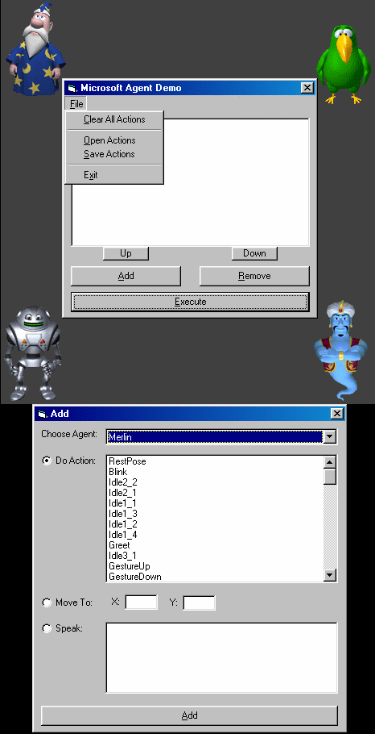



## Microsoft Agent Demo \- \*UPDATED\*

### Description

This program is a demo that allows you to command the different Microsoft Agents to do certain things. You must have Microsoft Agent to use this. You can download it at http://msdn.microsoft.com/msagent. Upon request, I have added the ability to move actions up and down, as well as save and open commands.
 
### More Info
 

             |
---                |---
**Submitted On**   |2001-04-04 21:56:40
**By**             |[Sean Ferguson](https://github.com/Planet-Source-Code/PSCIndex/blob/master/ByAuthor/sean-ferguson.md)
**Level**          |Intermediate
**User Rating**    |4.7 (14 globes from 3 users)
**Compatibility**  |VB 6\.0
**Category**       |[Miscellaneous](https://github.com/Planet-Source-Code/PSCIndex/blob/master/ByCategory/miscellaneous__1-1.md)
**World**          |[Visual Basic](https://github.com/Planet-Source-Code/PSCIndex/blob/master/ByWorld/visual-basic.md)
**Archive File**   |[Microsoft 17934442001\.zip](https://github.com/Planet-Source-Code/sean-ferguson-microsoft-agent-demo-updated__1-22115/archive/master.zip)

